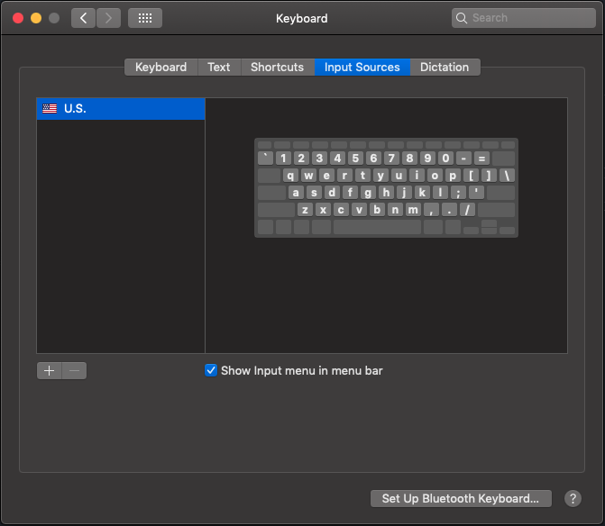
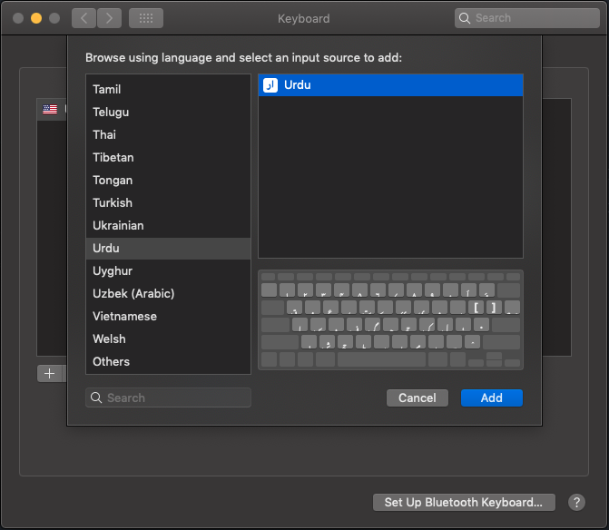
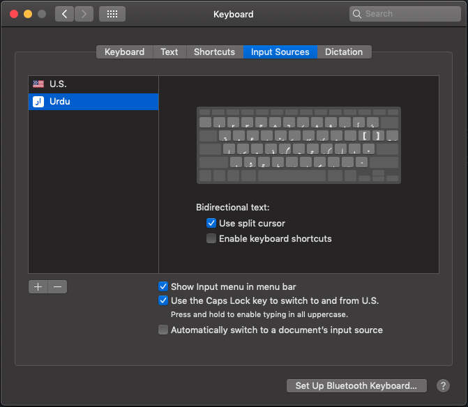

## Setting Up Urdu Input in a Mac

1. Go to *System Preferences* > *Keyboard*
2. In the *Input Sources* tab, Click *+* button

4. Scroll down to find and add "Urdu".

6. You are done, this is what it should look like.

Use the Caps Lock button to quickly switch between two languages. The menu bar will change with this for English:

and this for Urdu:

Try opening up a text editor and writing something, then pressing Caps Lock and writing Urdu. The letters follow a fairly phonetic pattern, you'll soon get the hang of it. It might be helpful to write down the keymap somewhere. Also note the locations of araab (zabar, zer, pesh).
