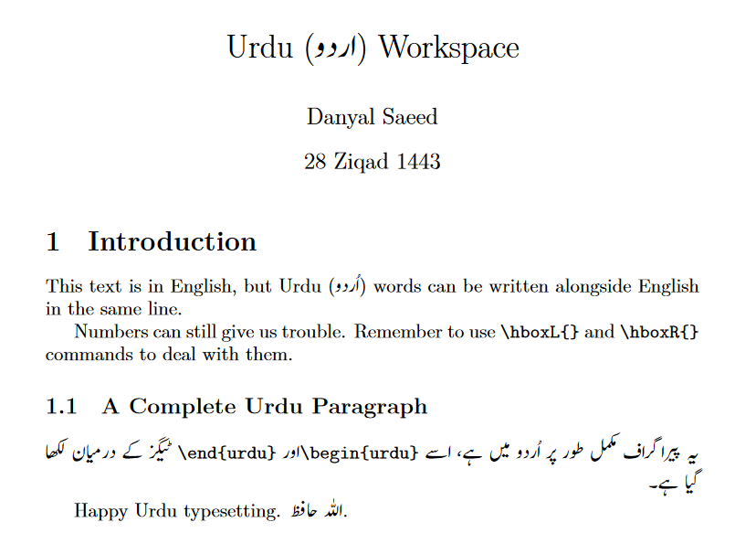

## Writing Urdu in LaTex

We will use [overleaf](https://www.overleaf.com) for this tutorial, but the same should apply to local LaTeX installations.

Summary:
1. Change Compiler to XeTeX
2. Upload a font that can display Urdu (e.g. Jameel Noori Nastaleeq)
3. Use polyglossia library to typeset Urdu.

### 1. Change Compiler to XeTeX

pdfLaTeX and LaTeX can't deal with unicode characters without going to extreme lengths which is not practical if you want to write more than a few letters of another language.

Although both LuaLaTeX and XeTeX should support unicode, I could not make LuaLaTeX work.

In overleaf, you can do this by clicking "Menu" in the top-left, and then changing "Compiler" from the drop down to XeTeX.


### 2. Use Urdu Font

In overleaf, you can upload the `.ttf` file of the Jameel Noori Nastaleeq font to your project. For ease of writing code, I have renamed it to `jameel.ttf`.

If you have the font installed in your system, it is found in `C:\Windows\Fonts` in Windows, and `/Library/Fonts` in MacOS.

### 3. Typesetting

We will use the `polyglossia` library. This lets us set a primary language, and one or more 'other' languages that you want to use in your document. In the first example, we will set Urdu as the primary language.

And, as Urdu text needs to be a bit larger to read properly, we will use `[Scale=1.25]` when loading the font for Urdu.

Here is the code:

\documentclass{article}
\usepackage{polyglossia}

\setmainlanguage{urdu}
\setotherlanguage{english}
\newfontfamily\urdufont[Scale=1.25]{jameel.ttf}

\title{اردو تجربہ گاہ}
\author{دانیال سعید}
\date{%
۲۸ ذیقعد ۱۴۴۳%
}%

\begin{document}

\maketitle

\section{%
پیش لفظ
}%

یہ تحریر اردو میں ہے، مگر اس میں اردو کے ساتھ انگریزی  یعنی %
\textenglish{English} %
کے الفاظ، ایک ہی سطر میں لکھے جا سکتے ہیں۔%

فون نمبر لکھنے کے لیے %
\verb|\hboxL{}| %
کا استعمال کریں۔ یہ بریکٹ کے اندر کی تحریر کو مکمل طور پر بائیں سے لکھے گا: %
\hboxL{%
+ ۹۲ ۴۲ ۱۲۳۴۵۶۷۸
}%

\end{document}


As of today, overleaf's editor doesn't work nicely with non-monospace text. You can type Urdu, but the cursor position displayed and the actual character being edited can be at different places, making it quite difficult to manage. A workaround is to use a local text editor, or to change browser fonts such that Arabic script is also monospaced.

Even with monospace font, we run into problems when our line starts with numbers. Notice how the `۲۸ ذیقعد ۱۴۴۳` looks like. I assure you, it is written in the correct order: day month year. Since numbers are written left to right, numbers can make you want to pull your hair out. Use `\hboxL{}` to force Left-to-Right, and `\hboxR{}` to force Right-to-Left. This can help fix many issues, but not all.

It can also be helpful to end each line with `%` as shown in the above example and write Urdu on separate lines in the code. It will be typeset in the same line in the .pdf as LaTeX ignores everything after the `%` sign.

Overleaf's online pdf renderer is not perfect either. The following is the result of the above code -- the screenshot is taken from the generated pdf:


And now finally, with main language as English, and secondary language as Urdu.

The code:

```
\documentclass{article}
\usepackage{polyglossia}

\setmainlanguage{english}
\setotherlanguage{urdu}
\newfontfamily\urdufont[Scale=1.25]{jameel.ttf}

\title{%
Urdu (\texturdu{اردو}) Workspace%
}

\author{Danyal Saeed}
\date{%
28 Ziqad 1443%
}%

\begin{document}

\maketitle

\section{%
Introduction
}%

This text is in English, but Urdu (\texturdu{%
اُردو%
}) words can be written alongside English in the same line.

Numbers can still give us trouble. Remember to use \verb|\hboxL{}| and \verb|\hboxR{}| commands to deal with them.

Happy Urdu typesetting. \texturdu{اللہ حافظ}.

\end{document}
```


And the result:

